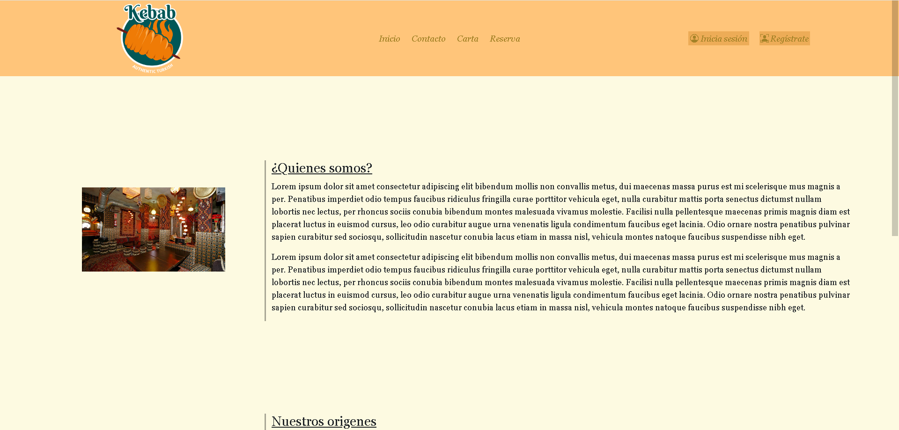
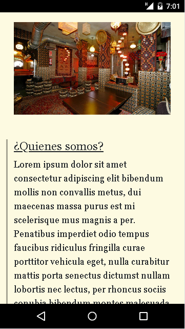
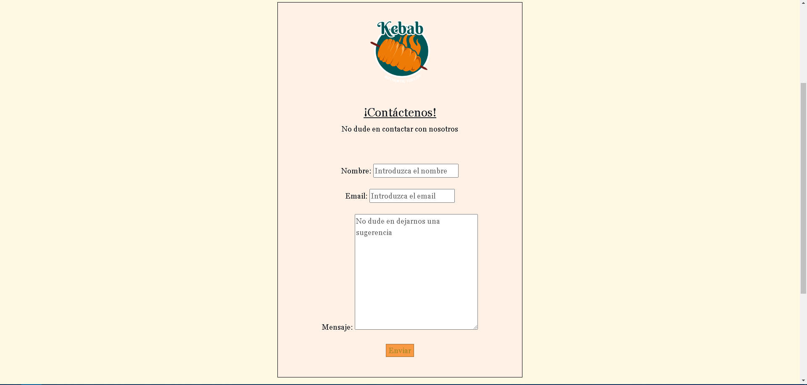
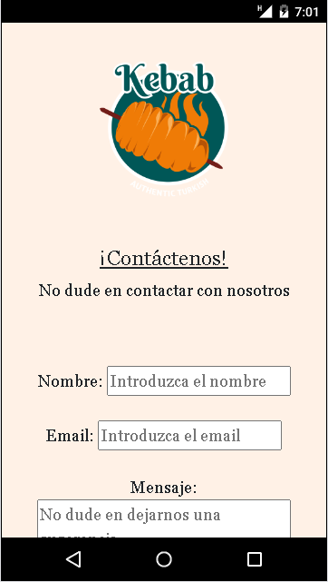
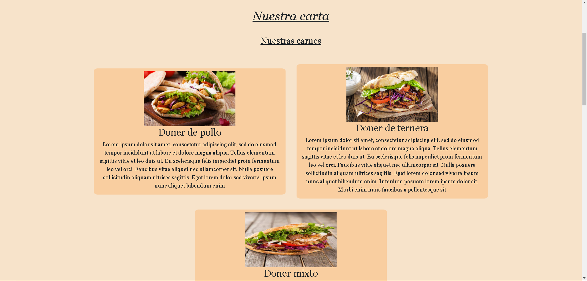
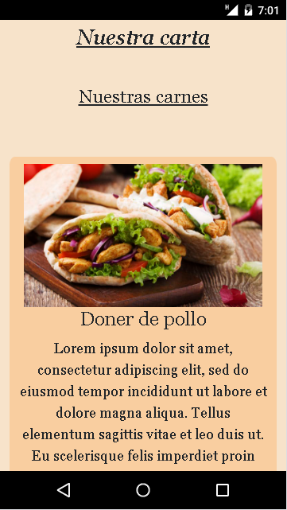
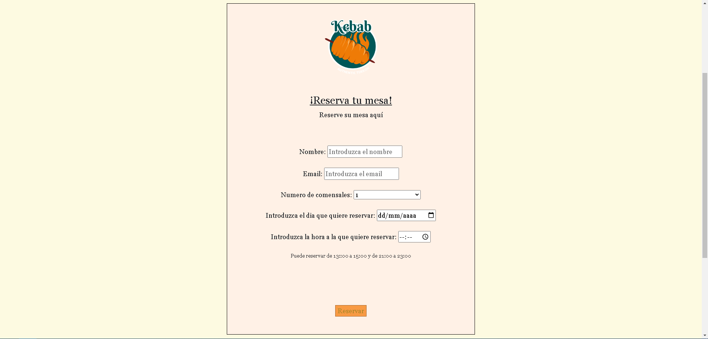
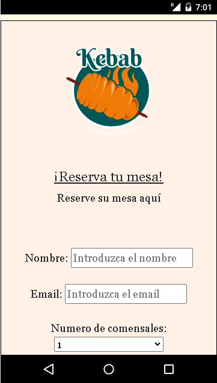
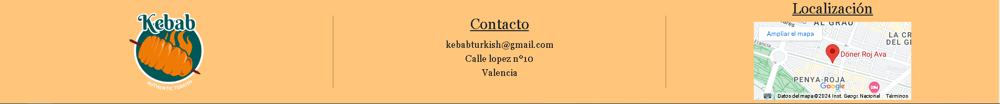
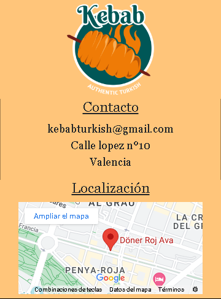

# TURKISH FOOD WEBSITE 💻

Hi Geeks! I have made a website for a Turkish restaurant based in 📍 Valencia

## Index 🧾

- [Technologies ⚙](#technologies-)
- [Pages 📇](#pages-)
- [Features](#features)
- [Deployment 👁‍🗨](#deployment-)
- [Download ⬇](#download-)
- [Roadmap ❗](#roadmap-)
- [Author 🙍‍♂️](#author-🙍‍♂️)
- [Time of development ⌛](#time-of-development-)


## Technologies ⚙


## Pages 📇

###Index.html


**Desktop**



**Mobile**

###Contact.html


**Desktop**



**Mobile**

### Menu.html


**Desktop**



**Mobile**

### Booking.html


**Desktop**



**Mobile**

### Navbar


**Desktop**


**Mobile**

### Footer


**Desktop**



**Mobile**


## Features
- **HTML tags:** Basic html tags 🎫

***Example:***
```sh
<html>

<head>
 <meta charset="UTF-8">
  <meta name="viewport" content="width=device-width, initial-scale=1.0">
  <title>Kebab Turco</title>
  <script src="./js/main.js"></script>

  <link href="https://cdn.jsdelivr.net/npm/bootstrap@5.3.2/dist/css/bootstrap.min.css" rel="stylesheet"
    integrity="sha384-T3c6CoIi6uLrA9TneNEoa7RxnatzjcDSCmG1MXxSR1GAsXEV/Dwwykc2MPK8M2HN" crossorigin="anonymous">
  <link rel="stylesheet" href="https://cdn.jsdelivr.net/npm/bootstrap-icons@1.11.3/font/bootstrap-icons.min.css">
  <link rel="stylesheet" href="./css/styles.css">
</head>

<body>
 <script src="https://cdn.jsdelivr.net/npm/bootstrap@5.3.2/dist/js/bootstrap.bundle.min.js"
    integrity="sha384-C6RzsynM9kWDrMNeT87bh95OGNyZPhcTNXj1NW7RuBCsyN/o0jlpcV8Qyq46cDfL"
    crossorigin="anonymous"></script>

  <script src="https://cdn.jsdelivr.net/npm/@popperjs/core@2.11.8/dist/umd/popper.min.js"
    integrity="sha384-I7E8VVD/ismYTF4hNIPjVp/Zjvgyol6VFvRkX/vR+Vc4jQkC+hVqc2pM8ODewa9r"
    crossorigin="anonymous"></script>

  <script src="https://cdn.jsdelivr.net/npm/bootstrap@5.3.2/dist/js/bootstrap.min.js"
    integrity="sha384-BBtl+eGJRgqQAUMxJ7pMwbEyER4l1g+O15P+16Ep7Q9Q+zqX6gSbd85u4mG4QzX+"
    crossorigin="anonymous"></script>

    <script src="./js/main.js"></script>
<header>

</header>

<section>

</section>

</body>

</html>
```
- **css styles:**```.classes```,```#Id´s```,```.active``` and ```:hover``` for styles  🎨

***Example:***
```sh
.sendbutton {
    background-color: rgb(248, 154, 67);
    color: rgb(170, 135, 39);
    ;
    border: 1px solid rgba(0, 0, 0, 0.342);
    transition: 0.5s;
}

.sendbutton:hover {
    background-color: rgb(199, 123, 52);
    color: rgb(128, 101, 28);
    transition: 0.5s;
}

#sectionmenu {
    margin-top: 10em;
    margin-bottom: 10em;
    transform: translateX(150px);
    opacity: 0;
    transition: 1s all ease;
    background-color: #f7e3ca;
    padding-top: 2em;
    padding-bottom: 2em;
}

#sectionmenu.active {
    transform: translateX(0);
    opacity: 1;

}
```

- **JavaScript:**```window.addEventListener``` for animations  🎞

***Example:***
```sh
function revealindex() {
    const sectionindex = document.querySelector("#sectionhome");
    sectionindex.classList.add("active");
   
};

window.addEventListener("load", revealindex);
```

- **Bootstrap:** for responsive structure  💻 📱 🖥

***Example:***
```sh
        <div class="container-fluid">
            <div class="row colornavfooter ">
                <div id="navleft" class="col d-flex  justify-content-center ">

                    

                </div>
                <div id="navcenter" class="col d-flex justify-content-center align-items-center ">
                    <div class="row ">
                        <div class="col-sm-12 col-xs-12 col-lg"><a href="../index.html">Inicio</a></div>
                        <div class="col-sm-12 col-xs-12 col-lg"><a href="contacto.html">Contacto</a></div>
                        <div class="col-sm-12 col-xs-12 col-lg"><a href="carta.html">Carta</a></div>
                        <div class="col-sm-12 col-xs-12 col-lg"><a href="reserva.html">Reserva</a></div>

                    </div>
                </div>
                <div id="navright" class="col d-flex justify-content-center align-items-center">
                    <div class="row d-flex justify-content-center align-items-center">

                        <div class="col d-flex justify-content-around align-items-center">
                            <div
                                class="col-6 d-flex justify-content-center align-items-center userloginsigninbutton text-center">
                                <a href="#"><i class="bi bi-person-circle iconloginsignin"></i>Inicia sesión</a>
                            </div>
                            <div class="col-1 d-flex justify-content-center align-items-center">&ensp;&ensp;&ensp;</div>
                            <div class="col-5 d-flex justify-content-center align-items-center userloginsigninbutton"><a
                                    href="#"><i class="bi bi-person-bounding-box iconloginsignin"></i>Regístrate</a></div>
                        </div>

                    </div>
                </div>
            </div>

        </div>
```
```justify-content-center```***,*** ```d-flex``` ***and*** ```align-items-center``` ***for centering the elemets.***

```col``` ***and*** ```row``` ***for displaying the elements in a row or column.***

```col/row-lg-(number of columns)```***,***```col/row-md-(number of columns)```***,***```col/row-sm-(number of columns)```***and***```col/row-xs-(number of columns)``` ***for making responsive elements in PC,Tablet or Mobile respectively***


## Deployment 👁‍🗨

You can see my website in this url:

> [https://frr95.github.io/Proyecto-HTML5-CSS3-BOOTSTRAP-RESPONSIVE-DESIGN/](https://frr95.github.io/Proyecto-HTML5-CSS3-BOOTSTRAP-RESPONSIVE-DESIGN/)

And also my commits in this url:

> [https://github.com/FRR95/Proyecto-HTML5-CSS3-BOOTSTRAP-RESPONSIVE-DESIGN/commits/master/](https://github.com/FRR95/Proyecto-HTML5-CSS3-BOOTSTRAP-RESPONSIVE-DESIGN/commits/master/)


## Download ⬇

Get a copy of my website in your local storage with this command in your terminal

```sh
git clone https://github.com/FRR95/Proyecto-HTML5-CSS3-BOOTSTRAP-RESPONSIVE-DESIGN.git
```


## Roadmap ❗

- **Dont use the contact and booking form** - This WebSite is not operative so the form is only visual and has no backend actions

- **The LogIn and SignIn user is not operational and has no link** - The same explained above


## Author 🙍‍♂️

- **Francisco Rocher Roure** - FullStack Developer
  - [GitHub](https://github.com/FRR95) - [LinkedIn](https://www.linkedin.com/in/franciscorocher/) - [Portfolio](https://franciscorocherdev.com/)


## Time of development ⌛

- One Week